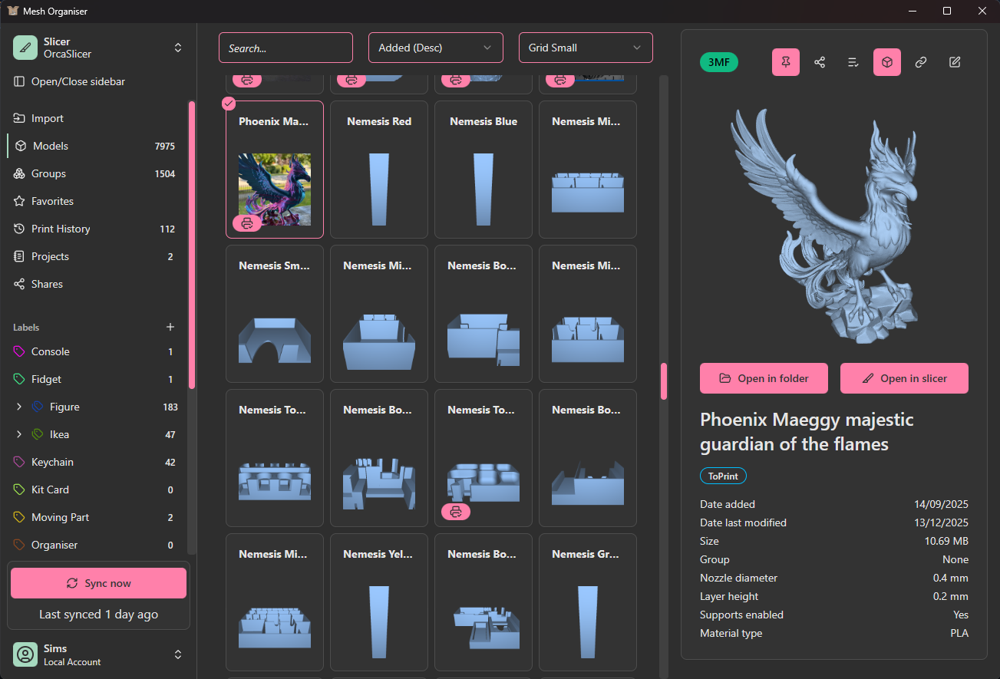

# Mesh Organiser

Competes with your downloads folder for storing models.

## Install

Download for:
- [Windows](https://github.com/suchmememanyskill/mesh-thumbnail/releases/latest/download/Mesh.Organiser_1.0.0_x64_en-US.msi) (.msi)
- Linux
    - [Debian/Ubuntu](https://github.com/suchmememanyskill/mesh-thumbnail/releases/latest/download/Mesh.Organiser_1.0.0_amd64.deb) (.deb)
    - [Fedora/RHEL](https://github.com/suchmememanyskill/mesh-thumbnail/releases/latest/download/Mesh.Organiser-1.0.0-1.x86_64.rpm) (.rpm)
    - Note: Only slicers installed via flatpak are supported
    - Note: Thumbnail generation currently isn't supported

See the [Releases](https://github.com/suchmememanyskill/mesh-organiser/releases) tab for more downloads and release notes

## Site integrations

Note: To open 'Open in ...' links from these websites, you need to enable them in settings. By default they are disabled to not overwrite any integrations you may currently have.

### [Thingiverse](https://www.thingiverse.com/)
- Redirect 'Open in Cura' to app (see settings)
- Import .zip (models only)
    - Will automatically make group with .zip name

### [Printables](https://www.printables.com)
- Redirect 'Open in PrusaSlicer' (and other slicers) to app (see settings)
    - When using redirect from Printables, the link field is automatically filled
- Import .zip (models only)
    - Will automatically make group with .zip name

### [Makerworld](https://makerworld.com)
- Redirect 'Open in Bambu Studio' to app (see settings)
- Ability to extract both model and thumbnail image (see settings)

## Structure breakdown

The app knows 3 layers of organisation:
- Model: A singular 3d model of any kind
- Group: A collection of 3d models with a strong relationship (like multiple parts of a bigger model)
    - Groups their contents are not intended to be edited after creation. Use Labels for this goal.
- Label: A collection of 3d models with a weak relationship (like multiple models/groups of the same type; like 'wall art' or 'puzzle')
    - Labels thier contents can be edited at any time using the label dropdown menu on groups, models or a collection of models.

## Additional features

- Compresses imported models to save disk space
- Hold Shift/Control to select multiple models or groups at once
- Import .step files (thumbnail generation does not work yet for .step files) (see settings, disabled by default)
- Open slicer after importing from website (see settings, disabled by default)
- Supported slicers: PrusaSlicer, OrcaSlicer, Cura, Bambu Studio
    - Request more via the [Issues tab](https://github.com/suchmememanyskill/mesh-organiser/issues)

## Credits

Developed by [Sims](https://github.com/suchmememanyskill)
- With development help from [dorkeline](https://github.com/dorkeline) and Ajadaz
- With testing help from atomique13 and ioan18

Links:
- [Thumbnail Generator](https://github.com/suchmememanyskill/mesh-thumbnail)
- [Report an issue / Request a feature](https://github.com/suchmememanyskill/mesh-organiser/issues)
- [Donate on Ko-Fi](https://ko-fi.com/suchmememanyskill)